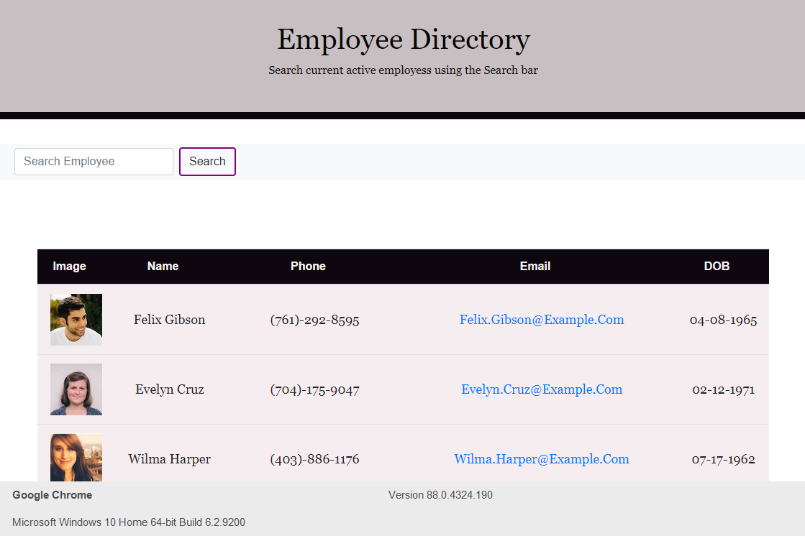

# REACT EMPLOYEE DIRECTORY

## Description

This application uses and API that populates random persons and creates a employee directory. The user will be able to use the search function in order to search for employees by NAME. They are also able to filter the search ascending name by alphbetical order

## Directions

In order to begin using the application in development run:

* npm start

This will run the functional application on LocalHost:3000

## Screenshot

## Tools used

* HTML, CSS, JS
* Bootstrap
* React
* Axios
* API (Random User name generator : https://randomuser.me/api/?results=200&nat=us )

## Author

Pieter Boerma - UoT coding bootcamp student

